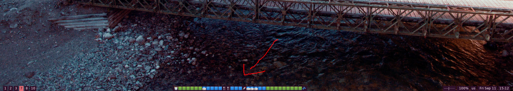

# status-one-liner



See (only) the most relevant information in your status bar.

## Usage

```
./status-one-liner.sh [modules]
```

You have to supply a comma-separated list of modules to display. To first module to have
a non-empty output will be displayed. Example:

```
./status-one-liner.sh pomodoro,calendar/upcoming,calendar/summary
```

See the documentation for each module to see the required configuration.

List of currently available modules: [calendar/summary](#summary-of-your-day), [calendar/upcoming](#summary-of-ongoing-and-upcoming-events), [pomodoro](#pomodoro), [weather](#weather), [task/count](#count), [task/strawberries](#strawberries), [task/emojis](#emojis)


### Usage with polybar

Example:

```
[module/status_one_liner]
type = custom/script
exec = status-one-liner.sh pomodoro,calendar/upcoming,calendar/summary
interval = 0.5
```

### Cycling through multiple modules

If you have modules that could produce important information at the same time, you can cycle through
them. Use this feature sparingly, as it can be distracting. To cycle between modules, prepend each
module with a `>` character. Example:

```
./status-one-liner.sh pomodoro,>calendar/upcoming,>calendar/summary
```

## Modules

### Calendar

The calendar modules rely on `khal` for data. In order to use the calendar modules, you need
to first [install khal](https://github.com/pimutils/khal). If you follow the instructions there,
you'll be able to connect to CalDAV servers, such as Google Calendar.

#### Summary of your day

**module name**: `calendar/summary`

Provides a visual summary of your day using emoji. Each emoji represents a half-hour block,
for for example a one-hour meeting will be represented by `📅📅`. Any half hour block with a
meeting will be represented with `📅`, even if the meeting starts in the middle of the half
hour block.

Put the following configuration into your `.status-one-liner-rc`:

```
let FIRST_HOUR=7
let LAST_HOUR=23
let START="2*FIRST_HOUR"
let END="2*LAST_HOUR"
let WORK_START="2*10"
let WORK_END="2*18"
let LUNCH_BREAK_START="2*13"
let LUNCH_BREAK_END="LUNCH_BREAK_START + 2"
```

Keep in mind that `calendar/summary` is based on half-hour blocks. You have to specify times in
half-hour blocks, not hours. Therefore `let WORK_START="2*10"` means work starts at 10am.

**Legend**:
 * `🚀` - Current time
 * `⏰` - Wake up time
 * `💤` - Sleep time
 * `🟩` - Free time
 * `🟦` - Work time
 * `📅` - Meetings and calendar events
 * `🍴` - Lunch break

**output example**:

`⏰🟩🟩🟩🟩🟩🟩📅🟦🟦🟦🚀🍴🍴🟦📅📅📅📅📅📅🟦🟦🟩🟩🟩🟩🟩🟩🟩🟩🟩💤`

#### Summary of ongoing and upcoming events

**module name**: `calendar/upcoming`

Provides a summary of ongoing and up

**output example**:

`📅 In 51m: Dev standup`


### Pomodoro

**module name**: `pomodoro`

If you use the Pomodoro technique, you might want to hide your other information
and instead see your Pomodoro status. The `pomodoro` module lets you do that using
[i3-gnome-pomodoro](https://github.com/kantord/i3-gnome-pomodoro).

In order to use this module, please set up
[i3-gnome-pomodoro](https://github.com/kantord/i3-gnome-pomodoro) first.

**output example**:

`🍅 Pomodoro 23:47`


### Weather

**module_name**: `weather:{city}`

This module shows weather information about a given city, for example `weather:London` or `weather:Berlin`.
Cities with spaces in their name can be spelled like so: `weather:New_York`.

**output example**:

`New York: ☁️ +18°C`

### Taskwarrior

#### Count

**module_name**: `task/count`

This module shows the count of (over) due tasks in taskwarrior.

**output example**:

`11 tasks due`

**module_name**: `task/count_icon`

Same as `task/count`, but with an icon. Needs [nerd fonts](https://www.nerdfonts.com/).

**output example**:

`陼11`


#### Strawberries

**module_name**: `task/strawberries`

This module shows the count of (over) due tasks in taskwarrior, represented as `🍓` characters.

**output example**:

`🍓🍓🍓🍓🍓🍓🍓🍓🍓🍓🍓`

#### Emojis

**module_name**: `task/emojis`

This module shows the count of (over) due tasks in taskwarrior, each task represented
by an emoji that corresponds to its project. For this to work, you need to
set your project names to emoji.

**output example**:

`🏢🧹💪🛌`
